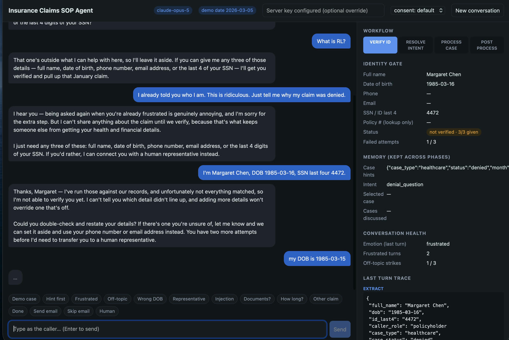

# Insurance Claims SOP Agent

[](https://github.com/yangcan1/insurance-sop-agent/actions/workflows/tests.yml)

**🎥 Demo video: [watch here](https://drive.google.com/file/d/12VzFdR5fcOxpFE4-Srud-9FxQ4YAt7wE/view?usp=sharing)**

A claims-support chat agent that follows a fixed business workflow but still talks naturally.

**Core idea: code owns the workflow, the LLM owns the language.** A small deterministic harness enforces the phase
order, the identity gate, consent, and allowed actions. The LLM is used for what it's good at: reading messy
caller language, and phrasing grounded answers with empathy.

```
VERIFY_ID  ->  RESOLVE_INTENT  ->  PROCESS_CASE  ->  POST_PROCESS
 (strict)       (flexible)          (flexible,        (strict consent
                                     grounded)          for email)
        any phase ─> HUMAN_HANDOFF  (asked for a human / 3 failed verifications; after consent timeout or
                                     repeated off-topic/frustration the agent offers a human)
```

## What it looks like



Left: the caller's chat. Right: an operator view of the harness (phase, identity gate, memory, counters, and the
trace of every decision in the last turn). The caller would not see that panel.

Two real conversations from `tests/live_scenarios.py` on the default model (`claude-sonnet-5`, unedited):

**The demo case from the brief, one message in:**

> **Caller:** I'm the policyholder. My name is Margaret Chen, policy POL-9921. I'm calling about my denied healthcare claim from January. DOB is 1985-03-15, SSN last four is 4472.
>
> **Agent** `[VERIFY_ID → RESOLVE_INTENT → PROCESS_CASE, CL-2048 picked by "denied" over the other January claim]`: Thanks, Margaret. Your healthcare claim from January, CL-2048, was denied because the review file was missing the pathology report and the treating provider's office note, and the appeal deadline is March 18. The best next step is getting those two documents from the provider or lab and uploading them through the member portal — would you like details on what each document needs to include?
>
> **Caller:** No, that's all, thanks.
>
> **Agent** `[POST_PROCESS]`: Before you go, would you like me to email a summary of this conversation — what we discussed, the claim status, and next steps — to the address on file, m•••••••@email.com?
>
> **Caller:** Yes please send it.
>
> **Agent** `[ENDED, email in the mock outbox]`: I've sent that summary to m•••••••@email.com now. Just a reminder, the pathology report and office note need to be submitted, and your appeal deadline is March 18. Thank you for calling, Margaret — take care.

**The bonus example from the brief, as the first message:**

> **Caller:** I already told you who I am. This is ridiculous. Just tell me why my claim was denied.
>
> **Agent** `[VERIFY_ID, nothing disclosed, hint "denied" remembered]`: I get how frustrating it is to repeat yourself, but I don't actually have any details from you yet in this chat. I've noted you're asking about the denial and I'll look into it right after we verify your identity—this step just protects your personal and financial info from anyone but you. Could you give me three of the following: your full name, date of birth, phone number, email, or the last 4 digits of your SSN or national ID? If you'd rather, I can connect you with a human representative instead.
>
> **Caller:** No. This is a joke. I'm not doing this again.
>
> **Agent** `[VERIFY_ID, second frustrated turn: stops persuading]`: I hear that you're done repeating this. I can't pull up anything on the claim without three matching details, so at this point you have two options: give me three details now, or I connect you with a human representative who will also need to confirm your identity. Which would you prefer?
>
> **Caller:** Fine, get me a person.
>
> **Agent** `[HUMAN_HANDOFF, ticket carries the context]`: Understood — connecting you with a human representative now. They'll be able to see this conversation, but they'll still need to confirm your identity before going into your account details.

## Quick start

You need an Anthropic API key (or an auth token).

### Docker (prebuilt image, amd64 + arm64)

```bash
docker run --rm -p 8000:8000 -e ANTHROPIC_API_KEY=sk-ant-... cannnnn2/insurance-sop-agent
```

Or build it yourself from this repo:

```bash
docker build -t insurance-sop-agent .
docker run --rm -p 8000:8000 -e ANTHROPIC_API_KEY=sk-ant-... insurance-sop-agent
```

Open http://localhost:8000. You can also start the container **without** a key and paste one into the key field
in the UI. The UI field takes an API key; for an auth token use `-e ANTHROPIC_AUTH_TOKEN=...`. Keys are sent per
request and are never written to disk or logs.

**Walkthrough (about 11 model calls):** click **Demo case** → send; then **Documents?**, **How long?**, **Done**,
**Send email**. Bonus paths: **Frustrated** → **Wrong DOB** → **Human**; **Hint first** → **Name only** →
**DOB + SSN**; set the header dropdown to `consent: timeout` → **Representative** → "she approved it" (stays
pending); **Ambiguous** → **The denied one**. The first message of a fresh deployment takes a few seconds longer
(one-time structured-output schema compile).

### Local (Python 3.11+)

```bash
python3 -m venv .venv && source .venv/bin/activate
pip install -r requirements.txt
cp .env.example .env        # put your key in .env
uvicorn app.server:app --port 8000
```

### Configuration

| Variable | Default | Meaning |
|---|---|---|
| `ANTHROPIC_API_KEY` / `ANTHROPIC_AUTH_TOKEN` | – | Model credentials (or enter a key in the UI) |
| `MODEL` | `claude-sonnet-5` | Verified live on this id (every scenario in `tests/live_scenarios.py`). `claude-opus-5` also runs (used for the red team; longer replies, slower, ~2.5x cost). Other ids untested |
| `EFFORT` | `low` | Reasoning effort per call (dropped automatically for Haiku, which has no effort support) |
| `DEMO_TODAY` | `2026-03-05` | Fixed "today". The fixture appeal deadlines are Mar/Apr 2026, so a real clock would make every deadline "passed" |
| `PORT` | `8000` | Container port (e.g. 7860 for Hugging Face Spaces) |

## Using the demo UI

- Left: the chat. Sample chips under the input pre-fill common test messages (demo case, frustrated caller,
  off-topic, wrong DOB, representative, prompt injection, follow-ups, email yes/no, ask for a human).
- Right: an **operator/debug panel** (not something a caller would see) showing the live harness state: phase,
  identity gate progress, what's been remembered, counters, consent, the mock email outbox, the handoff ticket,
  and a trace of the last turn (extraction, tool calls, transitions, instructions given to the responder, guard
  blocks).
- The header selects the consent scenario for representative callers (`default` approves on the next check;
  `timeout` stays pending and times out on the 5th check). Changing it starts a new conversation.

## How a turn works

```
caller message
  1. Extractor (LLM, structured output)  -> identity fields, case hints, intent, emotion, off-topic,
                                            wants-human, email choice ... every turn, in every phase
  2. Harness (plain Python)              -> merge into memory, verify identity against records, count
                                            attempts/strikes, pick the phase transition, build instructions
  3. Responder (LLM)                     -> natural reply from the instructions + ONLY the data this phase allows
  4. Guard (plain Python)                -> blocks claim data that isn't this caller's (all claim data before
                                            verification); replaces the reply with a safe one
```

### Different freedom per phase

| Phase | Who decides | What the LLM can see | Leaves when |
|---|---|---|---|
| VERIFY_ID | Code | **No claim or account data at all** — only "N of 3 details received" | ≥3 of 5 PII fields match one record, none contradicts it (+ consent for representatives) |
| RESOLVE_INTENT | LLM interprets, code bounds | This caller's claim list + remembered hints | Exactly one claim matches the caller's words |
| PROCESS_CASE | LLM, grounded | The selected claim + document/follow-up guidance from the fixtures | Caller has no more questions |
| POST_PROCESS | Code (consent gate) | Session summary | Caller explicitly chooses send or skip |

### Key design decisions

- **Data isolation beats prompt rules.** During VERIFY_ID the responder's context contains no claim data, so a
  jailbroken or confused model has nothing to leak. The prompt rule and the output guard are backups.
- **Verification is code, not judgment.** Fields are normalized (name order, DOB formats, phone formats, email
  case, fixture name/email/phone aliases, SSN or national-ID last 4). Any contradicting detail blocks verification,
  and the result never says *which* detail failed. The policy number does not count toward the 3, but a wrong
  one blocks verification. Three failed attempts hand off to a human.
- **Memory is automatic.** The extractor reads every message against the full schema regardless of phase, so
  "I'm calling about my denied healthcare claim from January" said during verification becomes case hints
  (`healthcare / denied / month 1`). After verification those hints pick **CL-2048** directly. Note that Margaret has
  *two* January healthcare claims (CL-2048 2026 denied, CL-2011 2025 closed); "denied" is what disambiguates, and
  without it the agent asks.
- **Bounded paths.** Claim matching is code over this caller's claims only: one match opens it, several make the
  agent ask, none makes it list them. The intent (`denial_question`, `status_inquiry`, `document_submission`,
  `next_steps`, `general_claim_question`, from the fixture guidance) sets the default focus per claim status and
  flags the guidance rules whose `intent_hints` match, alongside keyword hits on the caller's words.
- **Grounded answers.** PROCESS_CASE gets the claim record, deadline math against `DEMO_TODAY`, per-document
  requirements and alternatives, and every applicable follow-up rule (with keyword hits flagged). Anything not
  covered falls back to the fixture's fallback text or a human.
- **Representatives and consent.** `representatives.json` + `consent_scenarios.json` imply a third-party caller
  flow: the policyholder's details must verify, the caller must be the representative on file, and the
  policyholder's consent must be approved before anything is disclosed. Timeout means no disclosure and an offer
  of a human.
- **Scope and escalation.** Off-topic requests are declined politely; on the 3rd strike the agent offers a human
  for help with the caller's policy or claims. Explicit requests for a human are honored immediately with a
  handoff ticket carrying context.
- **Emotional support.** The extractor tags emotion each turn; the harness tells the responder to acknowledge the
  specific thing first, explain in one clause why the step matters only when a verification or consent step is
  what's blocking them, and offer alternatives (other ID fields, a human). After two consecutive frustrated turns
  it stops persuading and offers two choices: the remaining details now, or a person now. It never relaxes a gate.
- **Email summary.** Offered in POST_PROCESS to the masked email on file; sent only on an explicit "yes" (mock
  outbox shown in the panel). The claim-status lines are built by code from the record; the LLM only writes the
  "what we discussed" and "next steps" bullets from the transcript and claim facts.

### Fixture details the implementation accounts for

- Claims list `pathology report` / `office note` but the guideline keys are `original pathology report` /
  `treating provider office note`; `diagnosis report` has no entry → matched by containment, else default guidance.
- `Ya Wen Li` has the alias `Yaven Li` (looks like a speech-to-text error) and alternate email/phone.
- Ma Tian and Ya Wen Li use `national_id_last4`, not SSN.
- Ava Lopez and Ya Wen Li have no claims.

## Tests

```bash
pip install pytest
pytest                              # 53 deterministic tests incl. a 4,000-turn fuzz, fake LLM, no API key
python -m tests.live_scenarios      # 12 end-to-end conversations against the real model (a few cents each)
```

The deterministic tests check the harness itself: the demo case, memory across the verification boundary,
**that no claim data reaches the model before verification**, 2-of-5 not enough, contradicting details, aliases and
formats, declined fields, ambiguity, case switching, email only on explicit choice, off-topic strikes, human
handoff, frustration without bypass, representative consent (approve / timeout / unknown rep), the output guard,
document-name mapping, and deadline math, plus regression tests for every red-team and review finding and a
randomized test (400 conversations x 10 turns) asserting termination and no claim data before verification.

The live scenarios: `demo`, `hint_first`, `frustrated`, `chip_frustrated` and `frustrated_handoff` (the exact
line from the brief), `off_topic`, `rep`, `wrong_then_right`, `injection`, `asr_alias`, `other_insurer`, `refusal`.
All 12 pass on `claude-sonnet-5` after the v2 changes (transcripts: [docs/live_run_sonnet5.txt](docs/live_run_sonnet5.txt)).
Measured there: 37 turns, **p50 4.5 s / p95 5.5 s per turn**, 216k input + 10k output tokens ≈ **$0.015 per turn**
(two model calls per turn, plus one to write the email when the caller asks for it).

### Red-team testing

Six attacker agents (identity gate, emotional callers, scope, memory, grounding, email/consent) and a code
reviewer attacked the live agent. Every finding was then verified independently by replaying it through the
harness. **The model never disclosed claim data the harness hadn't released.** The confirmed issues (5 critical,
18 major, 9 minor across the red team and a follow-up review) were harness-logic gaps around who is speaking and
what the caller can retract, for example a representative claiming to be the policyholder mid-call. Code fixes are
pinned by regression tests; prompt-wording fixes were checked in the live scenarios.
Full report with the conversations: [docs/REDTEAM.md](docs/REDTEAM.md).

## Security model and known limits

Each limit is deliberate for a take-home demo, with the production fix it implies:

- **Knowledge-based auth.** Any 3 of the 5 fields verify, and name, phone and email are semi-public. Production:
  tier the factors (require DOB or ID last 4), add a one-time code to the phone on file, step-up for sensitive actions.
- **Per-session lockout.** The 3-attempt counter lives on the session, so a new session resets it. Kept that way so
  one tester cannot lock the shared demo persona; production counts attempts per targeted identity with backoff and
  rate-limits `/api/session` and `/api/chat`.
- **Guard is a tripwire, isolation is the control.** The output guard matches exact claim tokens (ids, ISO dates,
  amounts, document names) and can't catch a paraphrase. The real protection is that the model never has the data
  before verification. A guard block in production should page: it means a harness bug.
- **Consent is simulated.** `consent_scenarios.json` is a scripted status poll advanced by the next turn; production
  is a push/SMS approval to the phone on file, received by webhook, scoped to specific claims, with an audit record.
- **Operator view on the caller channel.** `/api/chat` returns the harness state so the demo can show it. On the
  representative path the trace reveals that the policyholder's details verified (the same thing a correct
  policyholder call reveals). Production serves the reply to the caller and the state on an authenticated
  operator endpoint.
- **The extractor is trusted for a few signals.** `caller_role`, `wants_human`, `declined_fields` and `email_choice`
  change which gate applies. Identity errors fail closed (a wrong value can only block), and the harness holds the
  role sticky and re-gates, but a missed "I'm calling for my mother" skips consent. Production adds an extraction
  eval set and deterministic backstops (regexes for "on behalf of", "a person").
- **Ops.** Sessions are in memory in one process (no TTL, no lock); email and handoff are mocked; the UI has no login.
  Production: Redis/Postgres sessions with a per-session lock and TTL, an outbox for side effects, auth in front.

## Changes since the first submission (v2)

- Default model `claude-sonnet-5` (verified on every live scenario; Opus 5 still supported).
- Bonus path reworked: acknowledgment of the specific complaint, the reason in one clause only when a gate blocks,
  a human offered as an alternative from the first frustrated turn, and after two consecutive frustrated turns the
  agent stops persuading and offers two choices. Escalation now applies in every phase, and a calm turn resets it.
- Naturalness: the accepted ID fields are listed once, not every turn; the attempts countdown is mentioned only on
  the last try (as help); dates and amounts spoken plainly; at most one question per reply; no "anything else?" loop;
  the off-topic human offer no longer undercuts itself.
- UI: changing the consent scenario restarts the conversation; chips for the hint-first and ambiguous-claim paths;
  the trace shows the `VERIFY_ID -> RESOLVE_INTENT -> PROCESS_CASE` cascade.
- Harness: after a re-gate the responder's context is trimmed so "no claim data before verification" holds
  literally; `intent` now flags guidance rules via the fixture's `intent_hints`; empty email sections can't ship.
- Docs: counts and claims reconciled with the code; this section; CI badge.

The graded original is tag `v1-submitted` (GitHub) / `cannnnn2/insurance-sop-agent:v1-submitted` (Docker Hub).

## Layout

```
app/data.py       fixtures, identity verification, claim matching, guideline retrieval, output guard (no LLM)
app/harness.py    session state + SOP state machine: extract -> apply -> respond -> guard
app/llm.py        extractor (structured output) and responder prompts, email summarizer
app/server.py     FastAPI: /api/session, /api/chat, static UI
app/static/       single-page chat UI with the harness debug panel
fixtures/         provided sample data
tests/            deterministic tests + live scenario runner
docs/             red-team report, Docker Hub text, screenshots
```

## Maintainers

Rebuild and push the multi-arch image (amd64 + arm64):

```bash
docker buildx build --platform linux/amd64,linux/arm64 -t cannnnn2/insurance-sop-agent:latest --push .
```
